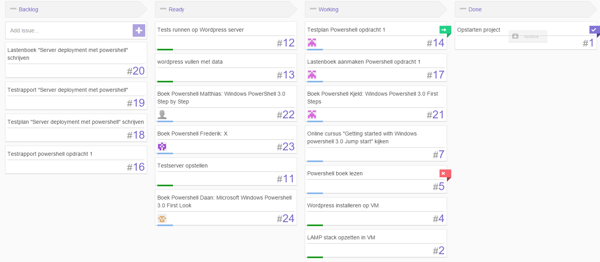
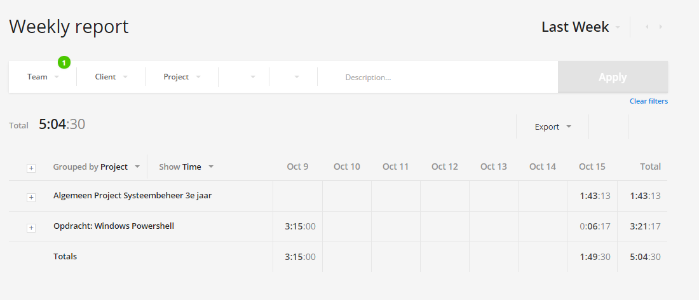

# Voortgangsrapport week 4

* Groep: 5
* Datum: 16/10/2015

| Student  | Aanw. | Opmerking |
| :---     | :---  | :---      |
| Kjeld Antjon |       |           |
| Matthias Derudder |       |           |
| Frederik Van Brussel |       |           |
| Daan Van Hecke |       |           |

## Wat heb je deze week gerealiseerd?

### Algemeen

* ...
* ...

### Kjeld Antjon

* Verder lezen/werken boek Powershell
* Opzoekwerk Powershell deployment opdracht
* Huboard aanvullen, testplan/lastenboek Powershell opdracht 1

### Matthias Derudder

* Afwerken boek powershell

### Frederik Van Brussel

* ...

[Afbeelding individueel rapport tijdregistratie]

### Daan Van Hecke

* Testserver optimaliseren
* Powershell microsoft virtual academy afwerken

## Wat plan je volgende week te doen?

### Algemeen
### Kjeld Antjon
* Boek Powershell: Afwerken tem hoofdstuk 8
* Beginnen VM: Powershell Deployment
### Matthias Derudder
### Frederik Van Brussel
### Daan Van Hecke
* Werken met collectd om een server op te zetten met monitoring
* Cheat sheet afwerken voor powershell.

## Waar hebben jullie nog problemen mee?

* ...
* ...

## Feedback technisch luik

### Algemeen

Het is bijna onmogelijk om een beeld te vormen van de toestand van het project omdat er onvoldoende detail zit in de rapportering hier rond. Dit geldt zowel voor de weekrapporten, gebruik Kanban als de neerslag van de resultaten. Jullie lijken wel enthousiast bezig te zijn, maar het is belangrijk om ons voldoende informatie te verschaffen over de vooruitgang!

Rapportering

* README.md
    * Link naar Kanban-bord en tijdregistratietool
    * Tabel begeleiders is borked
    * Alle groepsleden aanvullen
* Vervang meteen **overal** "student x" door jullie namen! In het sjabloon en alle huidige weekrapporten.
* Week 2:
    * tijdregistratie Daan?
    * Graag overzicht per deelopdracht zoals Kjeld deed
* Week 3:
    * Tijdregistratie ontbreekt helemaal??
    * Planning volgende week?
* Afspraak in de toekomst: gebruik "waar heb je nog problemen mee" als je vragen hebt voor de begeleiders.

Kanban-bord

* Afspraak voor de toekomst: Enkel begeleiders markeren een taak die jullie in de kolom "Done" geplaatst hebben als "Closed"

Windows-taak

* Er is geen enkele neerslag terug te vinden over deze opdracht => beschouwd als niet gerealiseerd!
    * Lastenboek uitwerken + een ticket voor elk teamlid met opgave van welk boek je gelezen hebt
    * Resultaten van deze opdracht? Deel je kennis! Samenvatting boek, cheat sheets met interessante commando's, scriptjes, links, ...
    * Testplan? Een testplan is wel degelijk mogelijk. Criteria kunnen zijn "is er een samenvatting voor het boek geschreven?", "is die begrijpbaar voor de andere teamleden?", "werken de scripts?"

Linux-taak

* Ik heb weinig zicht op de vooruitgang hier, onvoldoende detail in de neerslag
* Zeer weinig tickets hiervoor, verder opsplitsen in deeltaken!
    * Bv. Voordat je tests kan draaien op de Wordpress-server moet je eerst een of meerdere test-tools geselecteerd hebben, testscenario's beschreven hebben om uit te voeren, die automatiseren met de geselecteerde tools, procedure opzetten voor het uitvoeren (testplan!), voor het verzamelen en analyseren van resultaten, ...
* Lastenboek en testplan opstellen!

### Kjeld Antjon
### Matthias Derudder
### Frederik Van Brussel
### Daan Van Hecke

