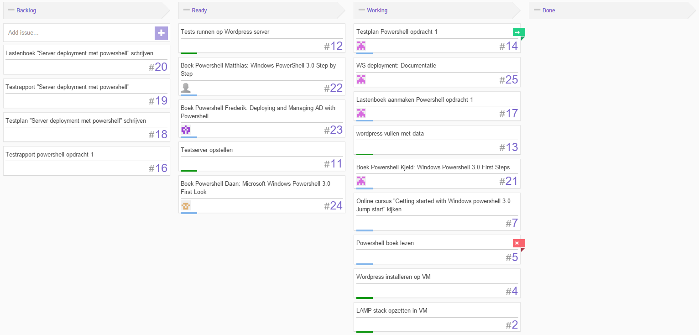
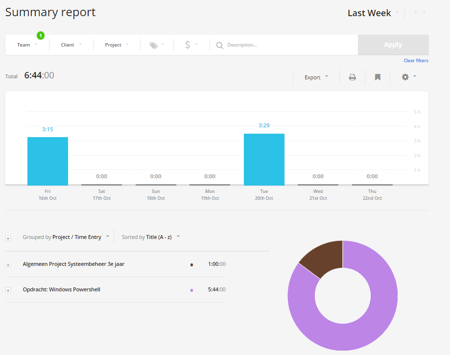

# Voortgangsrapport week 5

* Groep: 5
* Datum: 23/10/2015

| Student  | Aanw. | Opmerking |
| :---     | :---  | :---      |
| Kjeld Antjon |       |           |
| Matthias Derudder |       |           |
| Frederik Van Brussel |       |           |
| Daan Van Hecke |       |           |

## Wat heb je deze week gerealiseerd?

### Algemeen

* ...
* ...

### Kjeld Antjon

* Starten documentatie WS deployment opdracht
* Powershell boek: First Steps: Afwerken tem hoofdstuk 8

### Matthias Derudder

* Documenteren Windows PowerShell
* PowerShell boek: Step By Step uitgelezen
* Microsoft Virtual Academy: Using PowerShell for Active Directory

### Frederik Van Brussel

* Documenteren boek powershell
* collectd opstellen 

### Daan Van Hecke

* Collectd afwerken.
* Server opvullen met informatie.
* Grafana installeren om collectd te visualiseren.

## Wat plan je volgende week te doen?

### Algemeen
### Kjeld Antjon

* Afwerken boek Powershell + Starten implementatie van WS deployment
* 
### Matthias Derudder
### Frederik Van Brussel
### Daan Van Hecke
* De informatie visualiseren via Grafana.

## Waar hebben jullie nog problemen mee?

* ...
* ...

## Feedback technisch luik

### Algemeen
* Kanban bord:
    * Tickets vaak te algemeen. Een sprint bestaat niet uit 6 weken. Noteer bij het lezen van het boek en het doornemen van de online opleiding welke hoofdstukken je zal doornemen. 'Opdracht Windows Powershell' is geen goed ticket. Het heeft in dat geval weinig zin om kanban toe te passen. Ik maakte de opmerkingen ook mondeling en gaf een duidelijk voorbeeld hoe de sprints georganiseerd moeten worden en dat je duidelijke afspraken onderling moet maken. Ook in dit document zijn de taken voor volgende week te algemeen geformuleerd.  
* Windows:
    * De opdrachten worden uitgevoerd maar de documentatie kan beter.  
    * Goed dat voor de samenvatting slechts één document wordt gebruikt. De layout kan veel beter en een inhoudstafel mag geïntegreerd worden.Maak duideljke afspraken tijdens de sprint meetings wie wat zal aanvullen in het document tijdens de volgende sprint. Hoe wordt de kwaliteit van het document gewaarborgd? Schrijf een duidelijk testplan en maak hiervoor tickets aan.
    * Document cheatsheet is nog te beperkt. Elk teamlid vult tijdens het doornemen van de leerstof (boek/virtual academy) het document aan met de geleerde commando's. Maak hiervoor duidelijk afspraken rond de onderverdeling van het document in hoofdstukken (bvb verschillend document per hoofdstuk), de onderlingen samenwerking en de kwaliteitsgarantie.
    * Na 5 weken nog geen scripts aanwezig in de scripts folder. Van een team bestaande uit 4 leden verwacht ik meer na 5 weken. Alle scripts die je gebruikt of leert uit het boek of de online opleiding hou je bij. Zorg voor een duidelijke structuur.
### Kjeld Antjon
### Matthias Derudder
### Frederik Van Brussel
### Daan Van Hecke

