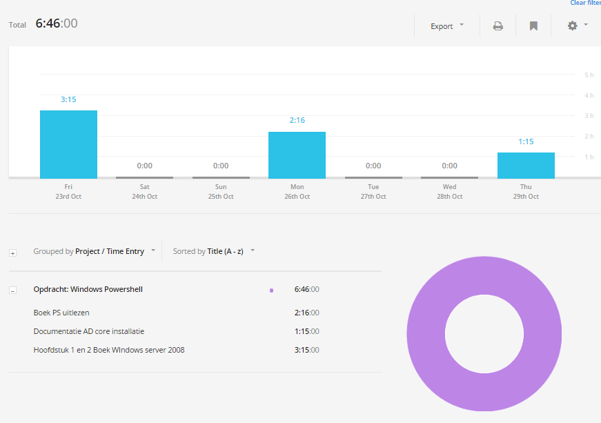

# Voortgangsrapport week 6

* Groep: 5
* Datum: 30/10/2015

| Student  | Aanw. | Opmerking |
| :---     | :---  | :---      |
| Kjeld Antjon |       |           |
| Matthias Derudder |       |           |
| Frederik Van Brussel |       |           |
| Daan Van Hecke |       |           |

## Wat heb je deze week gerealiseerd?

### Algemeen

### Kjeld Antjon

* Boek Powershell uitlezen (cheatssheets moeten nog afgewerkt worden)
* Documentatie voor Core installatie + HS1&2 van boek 1
* 

### Matthias Derudder

* Verzamelen scripts en cheatsheets voor PowerShell
* Microsoft Virtual Academy: Using PowerShell for Active Directory HF5 & HF6
* Powershell deployment: Opzetten server core
* Powershell deployment: HF1, HF2 en HF3

### Frederik Van Brussel

[Afbeelding individueel rapport tijdregistratie]

- collectd afwerken
- documentatie
- docs siege lezen

### Daan Van Hecke
* Server opvullen met informatie.
* Grafana installeren om collectd te visualiseren.

## Wat plan je volgende week te doen?

### Algemeen
### Kjeld Antjon

* Ideaal zou zijn om al t.e.m. hoofdstuk 6 van boek 1 te zijn in server core installatie.
* 
### Matthias Derudder
### Frederik Van Brussel
### Daan Van Hecke

## Waar hebben jullie nog problemen mee?

* ...
* ...

## Feedback technisch luik

### Algemeen

### Kjeld Antjon
### Matthias Derudder
### Frederik Van Brussel
### Daan Van Hecke

