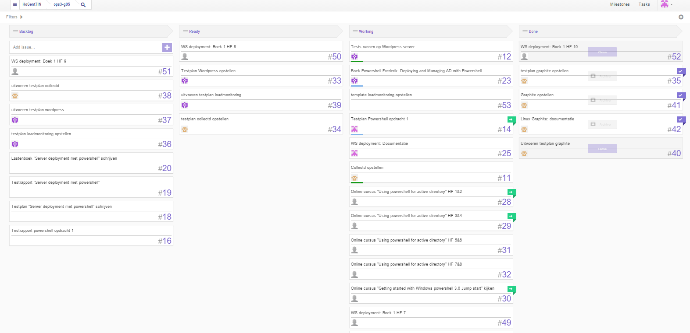
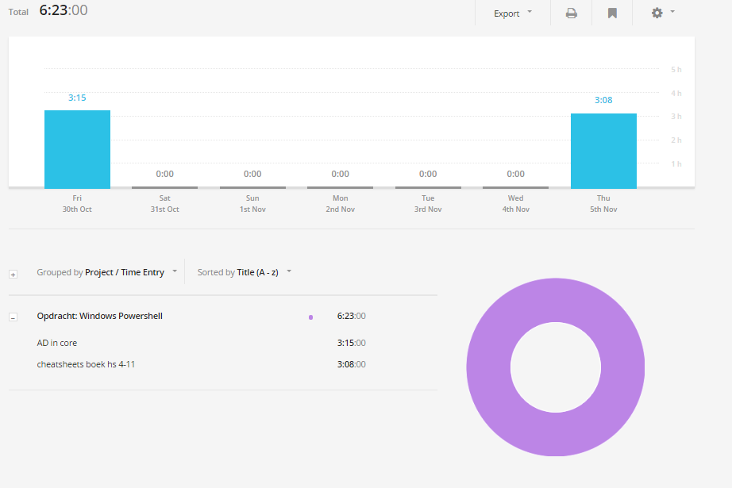

# Voortgangsrapport week 07

* Groep: 5
* Datum: 6/11/2015

| Student  | Aanw. | Opmerking |
| :---     | :---  | :---      |
| Kjeld Antjon |       |           |
| Matthias Derudder |       |           |
| Frederik Van Brussel |       |           |
| Daan Van Hecke |       |           |

## Wat heb je deze week gerealiseerd?

### Algemeen

* ...
* ...

[Afbeelding teamoverzicht tijdregistratie onderverdeeld per deelopdracht]

### Kjeld Antjon

* scripten en samenvatting boek afwerken
* Powershell deployment AD

### Matthias Derudder

* MVA: Powershell for Active Directory afwerken
* Powershell deployment: H4-8
* MVA: PowerShell scripting

### Frederik Van Brussel

* Testtemplates/strategie opstellen
* Siege scripts opstellen

### Daan Van Hecke

* Testrapport en testplannen opstellen
* Apache JMeter documentatie schrijven
* Visualiseren van data met APache JMeter.

## Wat plan je volgende week te doen?

### Algemeen
### Kjeld Antjon
- Boek 1 voor windows core deployment proberen afwerken

### Matthias Derudder
### Frederik Van Brussel
### Daan Van Hecke
- Alle testen geschreven te hebben voor Apache JMeter.

## Waar hebben jullie nog problemen mee?

* ...
* ...

## Feedback technisch luik

### Algemeen

### Kjeld Antjon
### Matthias Derudder
### Frederik Van Brussel
### Daan Van Hecke

