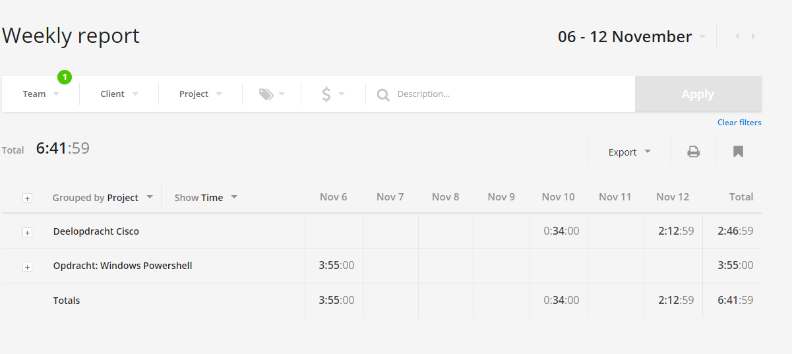

# Voortgangsrapport week 8

* Groep: 5
* Datum: 13/11/2015

| Student  | Aanw. | Opmerking |
| :---     | :---  | :---      |
| Kjeld Antjon |       |           |
| Matthias Derudder |       |           |
| Frederik Van Brussel |       |           |
| Daan Van Hecke |       |           |

## Wat heb je deze week gerealiseerd?

### Algemeen

[Afbeelding huidige toestand Kanban-bord(en) invoegen]

* ...
* ...

[Afbeelding teamoverzicht tijdregistratie onderverdeeld per deelopdracht]

### Kjeld Antjon

* Testing Windows Powershell core
* cisco labo 1 & 2

### Matthias Derudder

* Windows server core deployment

### Frederik Van Brussel

* ...

[Afbeelding individueel rapport tijdregistratie]

### Daan Van Hecke

* Monit starten
* Ansbible role aanmaken

## Wat plan je volgende week te doen?

### Algemeen
### Kjeld Antjon

* Deelopdracht cisco labo 2 afwerken, labo 3 en 4 zeker ook maken, misschien nog 5 en 6.
* Verder testen windows server core met Powershell.

### Matthias Derudder
### Frederik Van Brussel
### Daan Van Hecke
* Alles klaar krijgen van Monit.
* De tests afwerken.

## Waar hebben jullie nog problemen mee?

* ...
* ...

## Feedback technisch luik

### Algemeen

### Kjeld Antjon
### Matthias Derudder
### Frederik Van Brussel
### Daan Van Hecke

