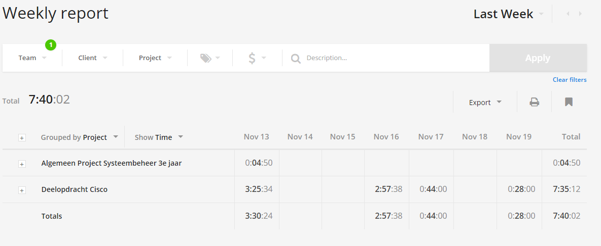

# Voortgangsrapport week nn

* Groep: 5
* Datum:

| Student  | Aanw. | Opmerking |
| :---     | :---  | :---      |
| Kjeld Antjon |       |           |
| Matthias Derudder |       |           |
| Frederik Van Brussel |       |           |
| Daan Van Hecke |       |           |

## Wat heb je deze week gerealiseerd?

### Algemeen

[Afbeelding huidige toestand Kanban-bord(en) invoegen]

* ...
* ...

[Afbeelding teamoverzicht tijdregistratie onderverdeeld per deelopdracht]

### Kjeld Antjon

* Labo 3-6 afgewerkt (labo 6 in les)

### Matthias Derudder

* Windows Server Deploymeny
* Azure

### Frederik Van Brussel

* ...

[Afbeelding individueel rapport tijdregistratie]

### Daan Van Hecke

* Mmonit afgewerkt

## Wat plan je volgende week te doen?

### Algemeen
### Kjeld Antjon

* Fysieke opstelling van 1 labo (in les)
* verder testen powershell core
* test voorbereiden powershell

### Matthias Derudder
### Frederik Van Brussel
### Daan Van Hecke

## Waar hebben jullie nog problemen mee?

* ...
* ...

## Feedback technisch luik

### Algemeen

### Kjeld Antjon
### Matthias Derudder
### Frederik Van Brussel
### Daan Van Hecke

