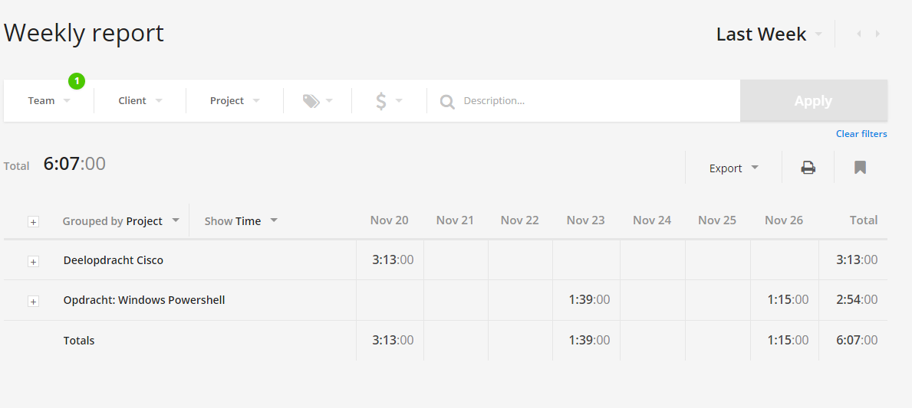

# Voortgangsrapport week 10

* Groep: 5
* Datum: 27/11/2015

| Student  | Aanw. | Opmerking |
| :---     | :---  | :---      |
| Kjeld Antjon |       |           |
| Matthias Derudder |       |           |
| Frederik Van Brussel |       |           |
| Daan Van Hecke |       |           |

## Wat heb je deze week gerealiseerd?

### Algemeen

* Fysieke opstelling Cisco opdracht 6.2.3.8
* Windows Server Powershell deployment/testing

[Afbeelding teamoverzicht tijdregistratie onderverdeeld per deelopdracht]

### Kjeld Antjon

* Fysieke opstelling Cisco opdracht 6.2.3.8
* Verder testen powershell deployment opdracht
* voorbereiden test Powershell

### Matthias Derudder

* ...

[Afbeelding individueel rapport tijdregistratie]

### Frederik Van Brussel

* ...

[Afbeelding individueel rapport tijdregistratie]

### Daan Van Hecke

* Samen met Frederik Ansible role Monit schrijven stap voor stap.
* Voorbereiden test Powershell

## Wat plan je volgende week te doen?

### Algemeen
### Kjeld Antjon

* Einde testen Powershell deployment
* Cisco opdrachten nog wat corrigeren

### Matthias Derudder
### Frederik Van Brussel
### Daan Van Hecke
* Ansible role van Monit afwerken en open-source maken.
* Testen of alles werkt op verschillende machines.

## Waar hebben jullie nog problemen mee?

* ...
* ...

## Feedback technisch luik

### Algemeen

### Kjeld Antjon
### Matthias Derudder
### Frederik Van Brussel
### Daan Van Hecke

